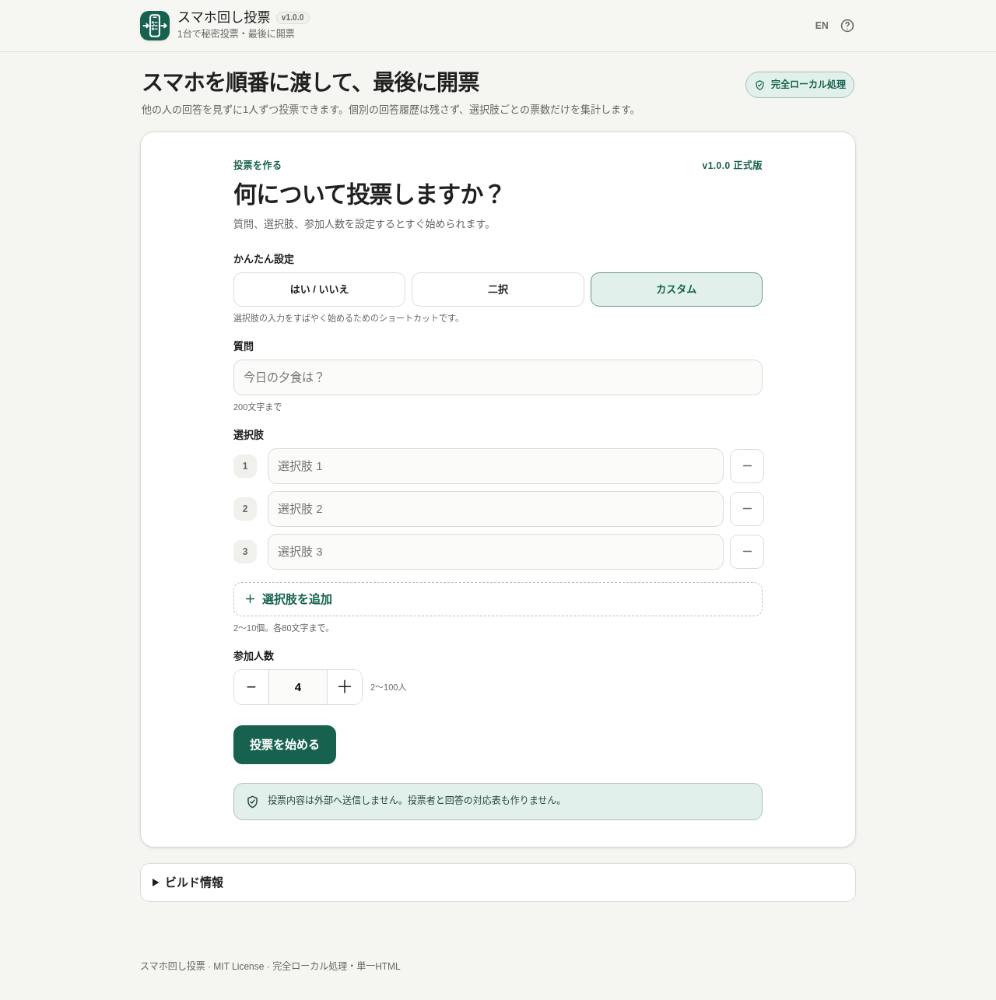

# Pass-the-Phone Vote / スマホ回し投票

[](https://github.com/ttomohisa/htmlapps-pass-the-phone-vote/actions/workflows/deploy-pages.yml)
[](LICENSE)
[](https://ttomohisa.github.io/htmlapps-pass-the-phone-vote/)

[English README](README.md)

1台のスマホを順番に渡し、他の人の回答を見ずに1人ずつ投票し、全員の投票が終わった後に集計結果だけを開票する単一HTMLツールです。

## 🚀 デモ

### [GitHub Pagesでスマホ回し投票を開く](https://ttomohisa.github.io/htmlapps-pass-the-phone-vote/)

GitHub Pagesから最初のHTMLを読み込んだ後、投票設定・投票・一時的なセッション復旧・集計・結果表示は端末内で処理されます。投票データをアプリからサーバーへ送信する処理はありません。

[](https://ttomohisa.github.io/htmlapps-pass-the-phone-vote/)

## 主な機能

- **1台のスマホで秘密投票** — 1人ずつ自分の投票画面だけを見て、終わったら次の人へスマホを渡します。
- **途中結果を最後まで非表示** — 全員が投票し、明示的に開票するまで票数や割合を表示しません。
- **誰が何に投票したかを保存しない** — 確定時に選択肢ごとの集計値だけを加算し、`1人目 → 選択肢A` のような個票履歴は保持しません。
- **よく使う形式をすぐ作成** — 「はい / いいえ」「二択」「カスタム」から始め、2〜10択・2〜100人で設定できます。
- **リロード後も安全に復旧** — `sessionStorage` には集計票数と安全な進行状態だけを保存し、未確定の回答は保存しません。
- **誤操作を抑える操作設計** — 投票確定、受け渡し、開票、やり直し、中止には必要なガードや確認を入れています。
- **意図した時だけ開票** — 長押しで開票し、長押しが難しい場合は確認付きの代替操作を使えます。
- **結果を再利用** — 集計結果のコピー、対応端末での共有、同じ内容でもう一度の投票に対応します。
- **スマートフォン重視** — 小さい画面、長い文言、safe-area、十分なタップ領域、日本語 / 英語に対応します。
- **完全ローカル処理の単一HTML** — 実行時CDN、Analytics、Telemetry、外部フォント、アプリ用API通信はありません。

## すぐに使う

### Webで使う

[デモを開く](https://ttomohisa.github.io/htmlapps-pass-the-phone-vote/)だけで利用できます。インストールやアカウント登録は不要です。

### ダウンロードして使う

1. このリポジトリまたはRelease ZIPから生成済みの `dist/index.html` をダウンロードします。
2. 最新のChromium系ブラウザ、Firefox、Safariで開きます。
3. 同じファイルは後からインターネット接続なしでも利用できます。

### 自分でビルドする

1. このリポジトリをダウンロードまたはクローンします。
2. Windowsで `build-standalone.bat` をダブルクリックします。
3. 読みやすい単一HTMLとして `dist/index.html` が生成されます。
4. gzip自己展開版として `dist/index.self-extract.html` も生成されます。

アプリ本体に実行時の外部ライブラリ依存はありません。

## 使い方

1. 必要なら「かんたん設定」から **はい / いいえ** または **二択** を選びます。
2. 質問、2〜10個の選択肢、2〜100人の参加人数を設定します。
3. **投票を始める** を押し、質問・人数・選択肢を確認して開始します。
4. 1人目にスマホを渡します。本人が **投票する** を押し、1つ選んで回答を確定します。
5. 確定後は選んだ回答表示が消え、中立な受け渡し画面になります。次の人へ渡します。
6. 全員が投票するまで繰り返します。
7. **長押しして開票** を押し続けると結果を表示します。長押しが難しい場合は代替操作から確認して開票できます。
8. 結果をコピー・共有するか、同じ内容でもう一度投票する、新しい投票を作る、のいずれかへ進みます。

### 投票設定

- **はい / いいえ** は標準の2択を自動入力します。
- **二択** は2つの自由入力から始まり、3つ目を追加した時点でカスタムへ切り替わります。
- **カスタム** は空のカスタム選択肢から入力を始めます。
- 空欄や重複する選択肢は投票開始前に拒否します。

### 結果操作

結果には質問、各選択肢の票数・整数割合、合計票数だけを表示します。表示する割合は、整数にした後も合計が100%になるよう決定的に調整します。

Web Share API対応端末では **結果を共有** から同じ集計テキストをOSの共有シートへ渡せます。アプリが結果を外部サービスへ自動送信することはありません。

## セッション復旧

投票開始後、`sessionStorage` には次の情報だけを一時保存できます。

- 質問
- 選択肢ラベル
- 各選択肢の集計票数
- 参加人数
- 投票済み人数
- 安全な進行状態

未確定の回答は保存しません。選択中・回答確認中にリロードした場合、その参加者は中立な受け取り待ち画面から投票し直します。

保存データは復旧前に整合性を確認し、壊れた状態や不一致がある場合は結果として使用せず破棄します。

## GitHub Pagesで公開する

このリポジトリには、単一HTMLをビルドしてGitHub Pagesへ公開するワークフローが含まれています。

1. リポジトリ名を `htmlapps-pass-the-phone-vote` としてGitHubへプッシュします。
2. **Settings → Pages → Build and deployment → Source** で **GitHub Actions** を選択します。
3. `main` へプッシュするか、Actions画面からPagesワークフローを手動実行します。
4. ビルド成功後、`https://ttomohisa.github.io/htmlapps-pass-the-phone-vote/` で公開されます。

リリース前のリポジトリチェックでは、単一HTML、必須アセット、バージョン表記、CSPなどテンプレート側の契約を検証します。

## 開発とビルド

```text
.
├─ src/index.template.html        # アプリ本体テンプレート
├─ app.config.json                # アプリ情報・バージョン
├─ assets/favicon.svg             # アプリアイコン / favicon元データ
├─ assets/screenshot.png          # 日本語スクリーンショット
├─ assets/screenshot-en.png       # 英語スクリーンショット
├─ build-standalone.bat           # Windows用ビルド入口
├─ build-standalone.ps1           # 単一HTML生成
├─ scripts/                       # リポジトリ / 単一HTML検証
└─ dist/
   ├─ index.html                  # readable単一HTML
   └─ index.self-extract.html     # gzip自己展開版
```

Windowsでビルド:

```powershell
.\build-standalone.bat
```

リポジトリチェック:

```powershell
powershell.exe -NoLogo -NoProfile -ExecutionPolicy Bypass -File .\scripts\check-powershell-syntax.ps1
powershell.exe -NoLogo -NoProfile -ExecutionPolicy Bypass -File .\scripts\check-repository.ps1
```

## プライバシーと通信防止

HTML読み込み後の処理は完全ローカル処理を前提としています。

- 生成HTMLのContent Security Policyには `connect-src 'none'` を設定します。
- 実行時CDN、Analytics、Telemetry、外部フォント、アプリ用API通信はありません。
- 誰がどの選択肢へ投票したかという対応関係は保存しません。
- 確定した投票は選択肢ごとの集計票数としてのみ保持します。
- 復旧用データは現在のブラウザセッション内の `sessionStorage` に保存します。

GitHub Pages版では最初のHTML配信の通信が発生します。ネットワークを使わず利用する場合は、生成済みの `dist/index.html` をローカルで開いてください。

## 制限事項

- 参加者本人の身元確認は行いません。
- 技術的に一人一票を保証する仕組みではありません。誰へスマホを渡すかはその場のグループで管理します。
- 家族、友人、少人数の会議、ワークショップなど、その場のカジュアルな投票を対象としています。
- 公的選挙、監査済み電子投票、改ざん耐性や法的効力が必要な投票には使用できません。
- 遠隔参加や複数端末を同期した投票には対応していません。
- 端末や開発者ツールを操作できる人によるブラウザ状態の確認・変更までは防げません。このツールが提供するのは受け渡し時のプライバシーUXであり、暗号学的な選挙セキュリティではありません。

## 使用ライブラリ

アプリ実行時のサードパーティライブラリ依存はありません。

リポジトリは共通の `htmlapps-template` のビルド・検証構成を使用しています。現在のNoticeは [THIRD_PARTY_NOTICES.md](THIRD_PARTY_NOTICES.md) を確認してください。

## コントリビューション

バグ報告や機能提案はIssueからお願いします。開発への参加方法は [CONTRIBUTING.md](CONTRIBUTING.md) を確認してください。

## ライセンス

Copyright © 2026 ttomohisa

このプロジェクトは [MIT License](LICENSE) で公開されています。
