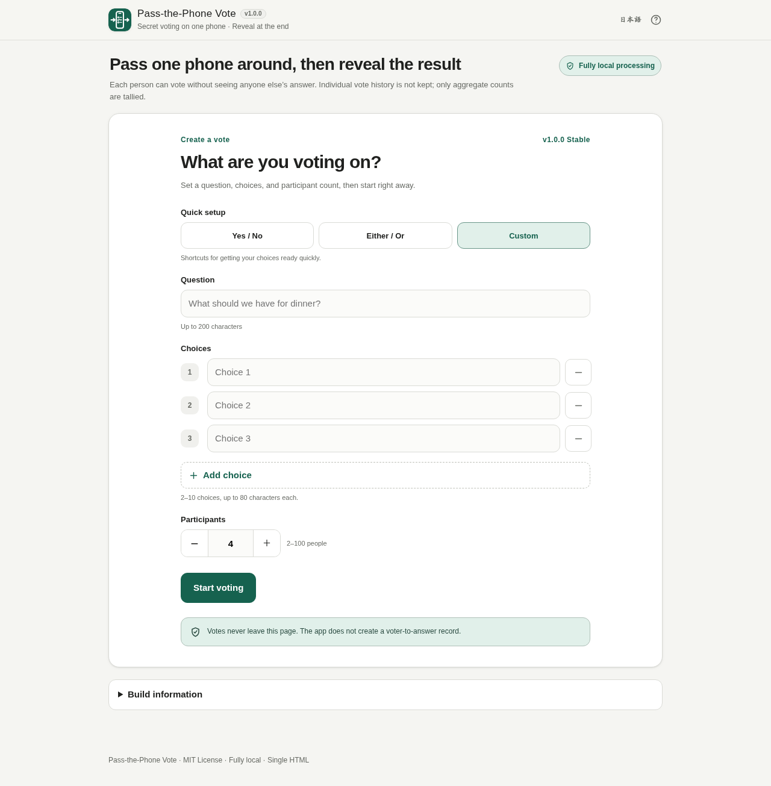

# Pass-the-Phone Vote

[](https://github.com/ttomohisa/htmlapps-pass-the-phone-vote/actions/workflows/deploy-pages.yml)
[](LICENSE)
[](https://ttomohisa.github.io/htmlapps-pass-the-phone-vote/)

[日本語版 README](README.ja.md)

A single-HTML voting tool for passing one phone around a group, letting each person vote without seeing anyone else's answer, and revealing only the aggregate result after everyone has voted.


## 🚀 Live demo

### [Open Pass-the-Phone Vote on GitHub Pages](https://ttomohisa.github.io/htmlapps-pass-the-phone-vote/)

GitHub Pages delivers the initial HTML. After it loads, vote setup, voting, temporary session recovery, tallying, and result display are processed locally on your device. Vote data is not sent to a server by the app.

[](https://ttomohisa.github.io/htmlapps-pass-the-phone-vote/)

## Features

- **Vote privately on one shared phone** — Each person sees only their own ballot, then hands the phone to the next participant.
- **Keep intermediate results hidden** — Counts remain hidden until everyone has voted and the result is deliberately revealed.
- **Do not keep voter-to-choice history** — A confirmed vote increments only the selected option's aggregate count. The app does not store records such as `person 1 → option A`.
- **Set up common votes quickly** — Start from Yes / No, Either / Or, or a custom vote with 2–10 choices and 2–100 participants.
- **Recover safely after reloads** — `sessionStorage` keeps only aggregate counts and safe progress state. Unconfirmed selections are not written to recovery storage.
- **Protect against accidental input** — Vote confirmation, handoff, reveal, restart, and stop actions include guards or confirmation where needed.
- **Reveal only when intended** — Hold the reveal button to open results, with a confirmation-based alternative for users who cannot perform a hold gesture.
- **Reuse or share aggregate results** — Copy results, use the OS share sheet when supported, or run the same vote again with counts reset.
- **Mobile-first operation** — The UI is designed for small phone screens, long labels, safe areas, large touch targets, and Japanese / English use.
- **Fully local single HTML** — No runtime CDN, analytics, telemetry, remote fonts, or application API calls are required.

## Quick start

### Use the web demo

Just [open the demo](https://ttomohisa.github.io/htmlapps-pass-the-phone-vote/). No installation or account is required.

### Use the download file

1. Download the generated `dist/index.html` from this repository or a release archive.
2. Open it in a current Chromium-based browser, Firefox, or Safari.
3. The same file can be opened later without an internet connection.

### Build it yourself

1. Download or clone this repository.
2. Double-click `build-standalone.bat` on Windows.
3. Use the generated `dist/index.html` as the readable single-file build.
4. `dist/index.self-extract.html` is also generated as a gzip self-extracting variant.

No runtime third-party library is required by the app itself.

## Usage

1. Optionally choose **Yes / No** or **Either / Or** from Quick setup.
2. Enter a question, 2–10 choices, and a participant count from 2–100.
3. Press **Start voting** and review the setup before beginning.
4. Hand the phone to the first participant. They press **Vote now**, choose one option, and confirm it.
5. After confirmation, the selected answer is cleared and a neutral handoff screen appears. Pass the phone to the next person.
6. Repeat until everyone has voted.
7. Hold **Hold to reveal** to display the result. If holding is difficult, use the alternative reveal action and confirm it.
8. Copy or share the aggregate result, vote again with the same setup, or create a new vote.

### Vote setup

- **Yes / No** fills the two standard answers automatically.
- **Either / Or** starts with two editable choices and remains a two-choice preset until a third choice is added.
- **Custom** starts from blank custom choices.
- Duplicate or blank choices are rejected before voting starts.

### Result actions

Results contain the question, each choice's vote count and whole-number percentage, and the total number of votes. Percentages are adjusted deterministically so the displayed whole numbers total 100%.

On supported devices, **Share result** passes the same aggregate text to the operating system's share sheet. The app does not automatically send the result to any remote service.

## Session recovery

After voting starts, `sessionStorage` can retain:

- Question text
- Choice labels
- Aggregate count for each choice
- Participant count
- Completed-vote count
- A safe progress phase

An unconfirmed selection is never stored. If a reload happens while someone is selecting or reviewing an answer, that participant returns to the neutral ready screen and votes again.

Stored recovery data is validated before use. Invalid or inconsistent state is discarded rather than shown as a result.

## Publish with GitHub Pages

The repository includes a workflow for building and deploying the standalone app to GitHub Pages.

1. Push the repository to GitHub as `htmlapps-pass-the-phone-vote`.
2. Open **Settings → Pages → Build and deployment → Source** and select **GitHub Actions**.
3. Push to `main`, or manually run the Pages workflow from the Actions tab.
4. After a successful deployment, the app is available at `https://ttomohisa.github.io/htmlapps-pass-the-phone-vote/`.

The repository checks verify the standalone output, required assets, version markers, CSP expectations, and other template contracts before release.

## Development and build layout

```text
.
├─ src/index.template.html        # Application source template
├─ app.config.json                # App metadata and version
├─ assets/favicon.svg             # App icon / favicon source
├─ assets/screenshot.png          # Japanese screenshot
├─ assets/screenshot-en.png       # English screenshot
├─ build-standalone.bat           # Windows build entry point
├─ build-standalone.ps1           # Standalone HTML builder
├─ scripts/                       # Repository / standalone verification
└─ dist/
   ├─ index.html                  # Readable single-HTML build
   └─ index.self-extract.html     # Gzip self-extracting build
```

Build on Windows:

```powershell
.\build-standalone.bat
```

Repository checks:

```powershell
powershell.exe -NoLogo -NoProfile -ExecutionPolicy Bypass -File .\scripts\check-powershell-syntax.ps1
powershell.exe -NoLogo -NoProfile -ExecutionPolicy Bypass -File .\scripts\check-repository.ps1
```

## Privacy and runtime network protection

The app is designed for fully local processing after the HTML has loaded.

- The generated HTML uses a Content Security Policy containing `connect-src 'none'`.
- There are no runtime CDN libraries, analytics, telemetry, remote fonts, or application API requests.
- Individual voter-to-choice mappings are not stored.
- Confirmed votes are retained only as aggregate counts.
- Recovery data stays in the current browser session through `sessionStorage`.

The GitHub Pages version requires the initial HTML request. To use the app without a network connection, open the generated `dist/index.html` locally.

## Limitations

- The app does not verify participant identity.
- It does not technically guarantee one person / one vote; the group controls who receives the phone.
- It is intended for casual in-person decisions, surveys, workshops, families, friends, and small groups.
- It is not an official, audited, tamper-proof, or legally binding electronic voting system.
- Remote participation and multi-device synchronized voting are not supported.
- Anyone with control of the device or developer tools may be able to inspect or modify browser state; the tool provides a private handoff UX, not cryptographic election security.

## Dependencies

The runtime application has no third-party library dependency.

The repository uses the common `htmlapps-template` build and verification structure. See [THIRD_PARTY_NOTICES.md](THIRD_PARTY_NOTICES.md) for the current notice state.

## Contributing

Bug reports and feature proposals are welcome through GitHub Issues. See [CONTRIBUTING.md](CONTRIBUTING.md) for development guidance.

## License

Copyright © 2026 ttomohisa

Licensed under the [MIT License](LICENSE).
